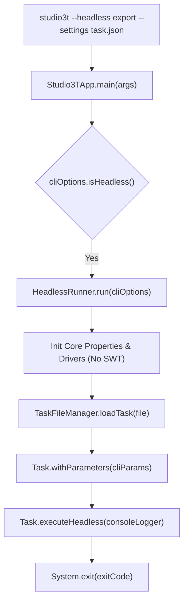
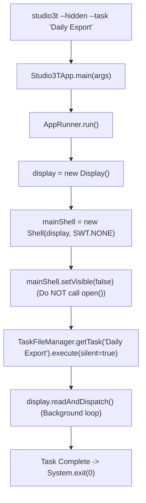
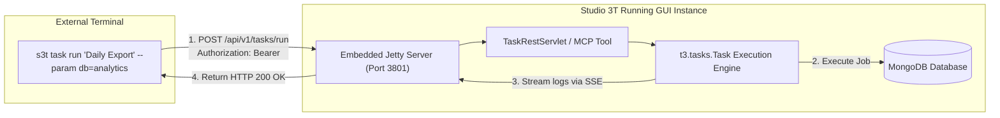
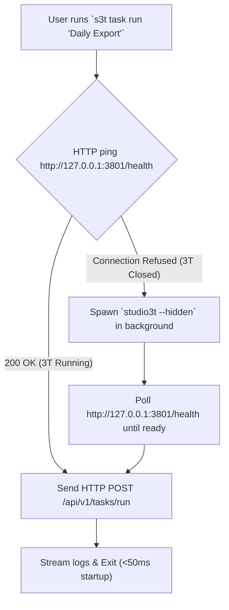

# Technical Architecture & Feasibility Report: Headless Studio 3T Options

## 1. Executive Summary & Resolution Matrix

This report provides a deep code investigation of all potential technical resolutions for enabling Headless / CLI execution in Studio 3T, considering the existing codebase (`product-suite/data-man-mongodb-ent`), embedded Jetty MCP server, and application launching mechanics.

| Resolution Option | Implementation Mechanism | Latency | Code Refactoring Effort | OS Headless (Docker/CI) Compatibility | Feasibility Verdict |
|---|---|---|---|---|---|
| **Option 1: Standalone Headless Engine** (`studio3t --headless`) | Direct JVM launcher bypassing SWT GUI | ~2–3 s | **High** (2–3 weeks) | 🟢 **100% Native** (No X11/GUI needed) | 🟢 **Feasible** (Requires decoupling `DCSTask` & `PasswordManagerGUI`) |
| **Option 2: Hidden Window Startup** (`studio3t --hidden`) | Launch SWT `Display` & `Shell` with `setVisible(false)` | ~2–3 s | ⚡ **Low** (1–2 days) | 🟡 **Requires `xvfb-run`** on Linux | 🟢 **Feasible** (100% code reuse immediately) |
| **Option 3: External HTTP CLI Utility** (`s3t` -> Jetty REST/MCP) | External CLI utility sending HTTP payloads to running 3T instance | ⚡ **<50 ms** | 🟢 **Medium** (3–5 days) | ❌ Requires running desktop GUI session | 🟢 **Feasible** (Instant DX for desktop users) |
| **Option 4: Hybrid Auto-Launching CLI** (`s3t` HTTP + `--hidden` fallback) | CLI checks HTTP port; auto-spawns `--hidden` instance if 3T is closed | ⚡ **<50 ms / 2s** | 🟢 **Medium-High** (5–7 days) | 🟢 **100% Coverage** | 🏆 **Recommended Architecture** |

---

## 2. Deep Code Investigation of Historical & Architectural Limitations

### 2.1 Limitation 1: SWT UI Thread & `Shell` Coupling

#### Codebase Analysis:
- **Location**: [`DCSTask.java:L163-L173`](file:///Users/ivan/Project/3t.tools.intellij/3t.tools/product-suite/data-man-mongodb-ent/src/main/java/t3/tasks/DCSTask.java#L163-L173)
```java
@Override
public void execute(boolean silent) {
    execute(AppWindow.getInstance().getTabFolderComposite(), silent);
}
```
- **Location**: [`TaskScheduleManager.java:L86-L89`](file:///Users/ivan/Project/3t.tools.intellij/3t.tools/product-suite/data-man-mongodb-ent/src/main/java/t3/tasks/TaskScheduleManager.java#L86-L89)
```java
Display display = AppWindow.getShell().getDisplay();
display.syncExec(() -> executeTasks(instant, isCurrentMinute));
```
- **Location**: [`ImportExportService.java:L115`](file:///Users/ivan/Project/3t.tools.intellij/3t.tools/product-suite/data-man-mongodb-ent/src/main/java/t3/utils/mongodb/importexport/ImportExportService.java#L115)
```java
/**
 * This is, hopefully, temporary. This class should know nothing UI-related; it should not know what a shell is.
 * Ideally we would use {@link Display#getActiveShell()} instead but as of 16/09/2021 this is bugged on Ubuntu...
 */
private final Supplier<Shell> shellSupplier;
```

#### Obstacle & Impact:
`DCSTask` directly queries `AppWindow.getInstance().getTabFolderComposite()` and `AppWindow.getShell()`. If executed in a pure headless JVM without initializing SWT `Display`, invoking `task.execute(true)` throws a `NullPointerException` or `SWTException: Device is disposed`.

#### Resolution Strategy:
1. For **Option 1 (Standalone Headless Engine)**: Refactor `DCSTask` to separate tab creation logic from the underlying `DataCompareAndSyncService`. Provide a dummy/null `Supplier<Shell>` to `ImportExportService`.
2. For **Option 2 (Hidden Window)**: Create a hidden `Shell` (`shell.setVisible(false)`). `AppWindow.getShell()` returns a valid non-null object, avoiding all NPEs without code refactoring.

---

### 2.2 Limitation 2: Password & Keystore Encryption UI Dialogs

#### Codebase Analysis:
- **Location**: [`AppRunner.java:L172`](file:///Users/ivan/Project/3t.tools.intellij/3t.tools/product-suite/data-man-mongodb-ent/src/main/java/t3/dataman/mongodb/app/AppRunner.java#L172)
- **Location**: [`PasswordManagerGUI.java:L30`](file:///Users/ivan/Project/3t.tools.intellij/3t.tools/product-suite/data-man-mongodb-ent/src/main/java/t3/utils/security/password/PasswordManagerGUI.java#L30)
```java
PasswordManagerGUI.initPasswordManager(mainShell);
```

#### Obstacle & Impact:
If a user has encrypted connection passwords using a master password or custom keystore, `PasswordManagerGUI` attempts to open an SWT modal dialog asking for password input. In unattended CI/CD environments, this modal causes the process to hang indefinitely.

#### Resolution Strategy:
Introduce a `HeadlessPasswordProvider` interface. In CLI/headless mode, read master passwords from the environment variable `S3T_MASTER_PASSWORD` or CLI flag `--master-password <pwd>`.

---

### 2.3 Limitation 3: Scheduler 1-Minute Interval Floor

#### Codebase Analysis:
- **Location**: [`TaskScheduleManager.java:L74`](file:///Users/ivan/Project/3t.tools.intellij/3t.tools/product-suite/data-man-mongodb-ent/src/main/java/t3/tasks/TaskScheduleManager.java#L74)
```java
Instant thisMinute = now.truncatedTo(ChronoUnit.MINUTES);
```

#### Obstacle & Impact:
`TaskScheduleManager` operates on a 1-minute truncation loop (`ChronoUnit.MINUTES`), preventing sub-minute high-frequency job execution (e.g. running every 5 or 10 seconds).

#### Resolution Strategy:
CLI/HTTP invocation (`studio3t task run`) bypasses `TaskScheduleManager` entirely. External OS schedulers (Cron, Windows Task Scheduler, Kubernetes CronJob) trigger the CLI command on any desired frequency.

---

### 2.4 Limitation 4: Dynamic Parameterization (`--param db=X`)

#### Codebase Analysis:
- **Location**: [`Task.java`](file:///Users/ivan/Project/3t.tools.intellij/3t.tools/product-suite/data-man-mongodb-ent/src/main/java/t3/tasks/Task.java) and [`ExportTask.java:L51`](file:///Users/ivan/Project/3t.tools.intellij/3t.tools/product-suite/data-man-mongodb-ent/src/main/java/t3/tasks/ExportTask.java#L51)

#### Obstacle & Impact:
Tasks serialize target database names, collection names, and output file paths into static map structures (`ExportJob.toMap()`). Currently, there is no runtime variable substitution.

#### Resolution Strategy:
Implement map template replacement in `Task.java`:
```java
public Task<?> withParameters(Map<String, String> params) {
    // Replace ${paramName} in task definition map before execution
}
```

---

## 3. Deep Research on Option 1: Standalone Headless Engine (`studio3t --headless`)

### 3.1 Architectural Flow



### 3.2 Code Modification Requirements
1. **Entry Point Interceptor in `Studio3TApp.java`**:
   ```java
   public static void main(String[] args) {
       CliOptions cli = CliOptions.parse(args);
       if (cli.isHeadless()) {
           int exitCode = HeadlessRunner.execute(cli);
           System.exit(exitCode);
       }
       // Existing GUI startup path
       configureLogging();
       AppRunner.run();
   }
   ```
2. **Headless Progress Listener**:
   Replace `OperationsPane` listeners with a `ConsoleProgressObserver` writing ANSI progress bars to `System.out`.

### 3.3 Pros & Cons
- ✅ **Pros**: 100% native headless execution. Runs in zero-GUI Docker containers (Alpine/Debian) without X11 or Virtual Framebuffers.
- ❌ **Cons**: Requires refactoring `DCSTask` and `PasswordManagerGUI` to completely eliminate SWT references.

---

## 4. Deep Research on Option 2: Hidden Window Startup (`studio3t --hidden`)

### 4.1 Architectural Flow



### 4.2 Code Modification Requirements
In [`AppRunner.java:L444`](file:///Users/ivan/Project/3t.tools.intellij/3t.tools/product-suite/data-man-mongodb-ent/src/main/java/t3/dataman/mongodb/app/AppRunner.java#L444):
```java
if (CliOptions.isHiddenMode()) {
    mainShell.setVisible(false);
    Task task = TaskFileManager.getInstance().getTaskByName(CliOptions.getTaskName());
    task.execute(true);
    // Wait for BackgroundOperation completion and exit
} else {
    mainWindow.open();
}
```

### 4.3 OS Compatibility & Nuances
- **Windows**: 🟢 Completely invisible. No taskbar icon created when `setVisible(false)` is set.
- **macOS**: 🟡 Cocoa creates a Dock icon by default. Suppress via JVM flag `-Dapple.awt.UIElement=true`.
- **Linux Headless (Docker/CI)**: ⚠️ `new Display()` fails without X11 `$DISPLAY`. Easily solved by invoking via `xvfb-run studio3t --hidden ...`.

---

## 5. Deep Research on Option 3: External HTTP CLI Utility (`s3t`)

### 5.1 Architectural Flow



### 5.2 Code Assets Used
- **Jetty Server**: [`McpServerBootstrap.java:L62`](file:///Users/ivan/Project/3t.tools.intellij/3t.tools/product-suite/data-man-mongodb-ent/src/main/java/t3/mcp/server/McpServerBootstrap.java#L62)
- **MCP Tool Registry**: [`Studio3TToolService.java`](file:///Users/ivan/Project/3t.tools.intellij/3t.tools/product-suite/data-man-mongodb-ent/src/main/java/t3/mcp/tools/Studio3TToolService.java)

### 5.3 Technical Advantages
- ⚡ **Instant Execution (<50 ms)**: No JVM cold-start penalty.
- 🔓 **Pre-Authenticated Keystore**: Reuses connection passwords already unlocked in the active desktop GUI session.
- 🛡️ **Local Token Security**: Authentication via bearer token saved to `~/.3t/api.token` (`0600` permissions).

---

## 6. Deep Research on Option 4: Hybrid Auto-Launching CLI Architecture (Recommended)

### 6.1 Flow Diagram



### 6.2 Implementation Plan
1. **Studio 3T Side**:
   - Add a lightweight `TaskRestServlet` to Jetty in [`McpServerBootstrap.java`](file:///Users/ivan/Project/3t.tools.intellij/3t.tools/product-suite/data-man-mongodb-ent/src/main/java/t3/mcp/server/McpServerBootstrap.java).
   - Add `--hidden` flag support to [`Studio3TApp.java`](file:///Users/ivan/Project/3t.tools.intellij/3t.tools/product-suite/data-man-mongodb-ent/src/main/java/t3/dataman/mongodb/app/Studio3TApp.java).
2. **CLI Utility (`s3t`)**:
   - Single standalone binary (Go or Rust) executable on Windows (`s3t.exe`), macOS (`s3t`), and Linux (`s3t`).
   - Automatically detects running instances or launches background hidden instances on demand.
